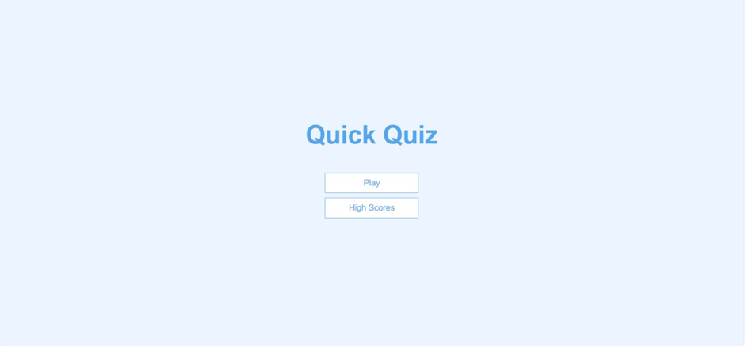
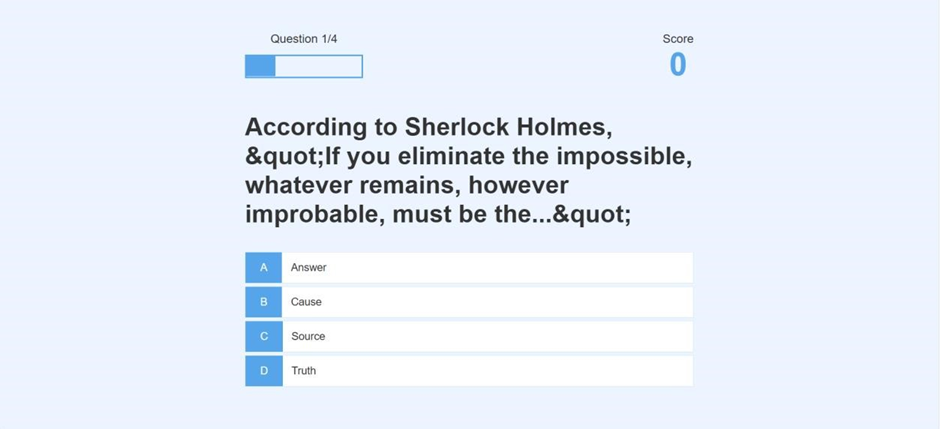
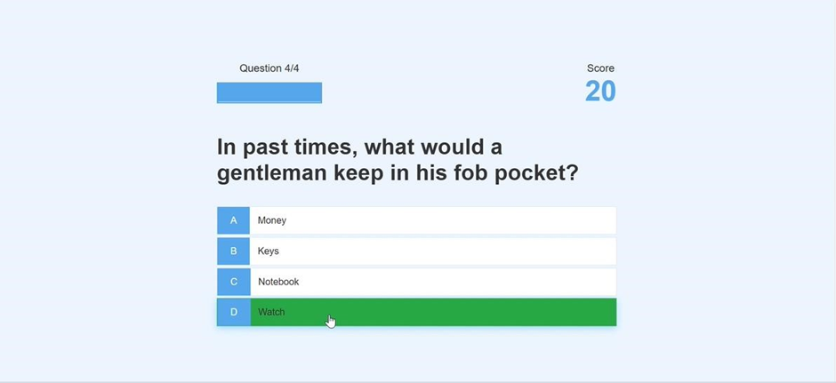
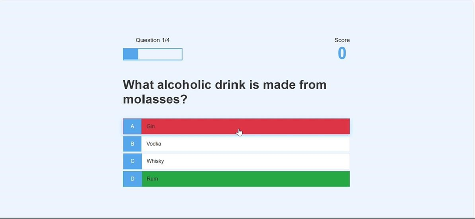
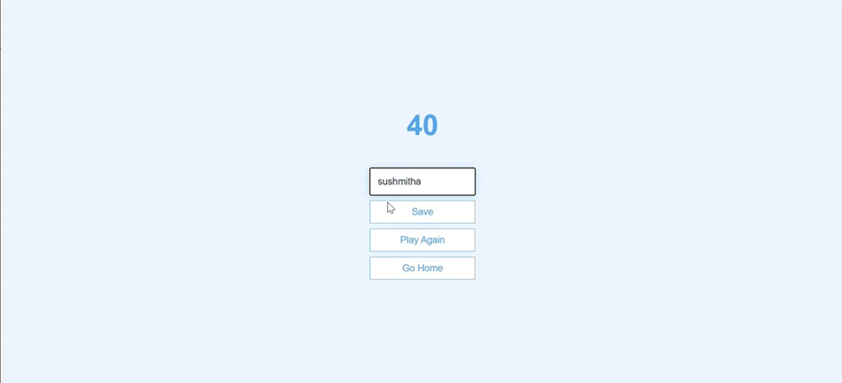

# Quiz Web App
A simple and interactive quiz web application built using HTML, CSS, and JavaScript. Users can test their knowledge, view scores, and enjoy a responsive design.
## Features
- Multiple-choice questions loaded from JSON
- Real-time score tracking
- End screen with final score
- High score saving using local storage
- Responsive design for desktop and mobile
## Folder Structure
- `.vscode/` – Editor settings
- `index.html` – Landing page
- `game.html`, `game.js`, `game.css` – Main quiz interface
- `end.html`, `end.js` – Final score screen
- `highScores.js`, `highScores.css` – High score logic and styling
- `questions.json` – Quiz questions
- `app.css` – Shared styles
## How to Run
1. Clone the repository:
git clone https://github.com/deepasiddaraju/Quizapp.git
2. Open `index.html` in your browser.
3. Start the quiz and enjoy!
## 📸 Screenshots

### 🟢 Start Quiz

### 🏠 Home Screen

### ❓ Question Display

### 🔄 Score Update

### 💬 Feedback Screen

### 🏁 End of Quiz

## 🧠 Credits

This project was inspired by [James Q Quick's Build a Quiz App](https://github.com/jamesqquick/Build-A-Quiz-App-With-HTML-CSS-and-JavaScript).
## 📄 License
This project is licensed under the MIT License. See the [LICENSE](LICENSE) file for details.

